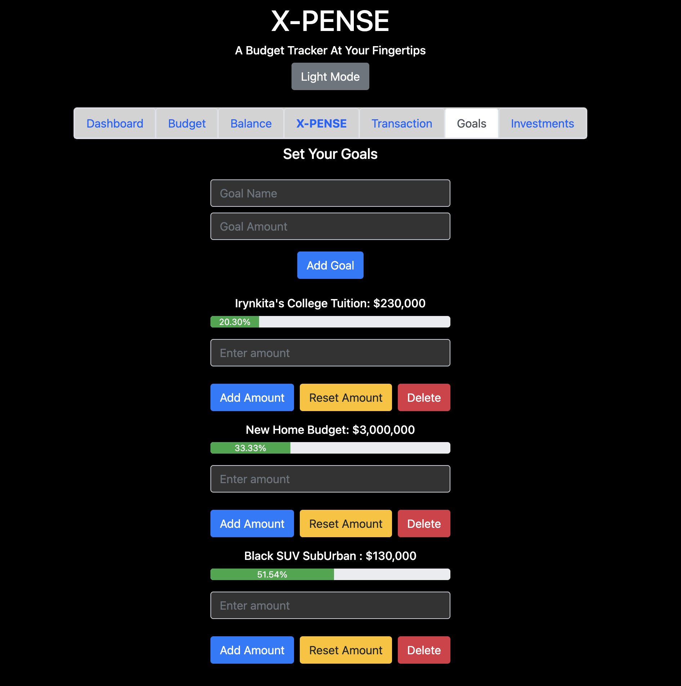

<div style="text-align: center;">
    <h1>X-PENSE</h1>
</div>

X-PENSE App is a personal finance management application that allows users to track their cash on hand, bank account balances, savings, expenses and set financial goals. The application is built using Flask for the backend and React for the frontend. In addition, under Investments tab, the user can check a live crypto price update that can be added to the dashboard to calculate over all budget.


## CORE-Features

- Add and manage transactions
- Set and track budget goals
- View balance and budget summaries
- Dark-Light mode support
- Mobile Compatibility
- User authentication
- Live Crypto Update APIs
- Responsive Graphs and Progress Bars
- Log In/Out Feature 
- CRUD ops 
- Input validation checks

### SERVER - Backend Activation
<!-- pipenv install -->
<!-- pipenv shell -->
1. Navigate to the `Server` directory:
```
cd Server
```
1. Run the Flask application: 
```
python app.py
```

### CLIENT - Frontend Activation
1. Navigate to the `Client` directory:
```
cd Client
```
2. Install the required dependencies: 
```
nvm use 20.16
```
3. Start the REact application:
```
npm run dev
```
## Usage

- Dashboard consolidates all transactions performed across all components
- Use the frontend interface to input your cash on hand, bank account balance, savings, expenses, goals and investements.
- Set future goals with responsive progress bars that allows you to keep track until goal is met by displaying `saved` and `target` features.
- Live Crypto Update prices that you can add it up to the Dashbaord and make future investments. 


## RESTful API CRUD operations:
- `GET`
- `POST`
- `PUT`
- `DELETE`

## Technologies Used
<div style='display: inline-block;'>
    
    
    
    
    
    
    
</div>
