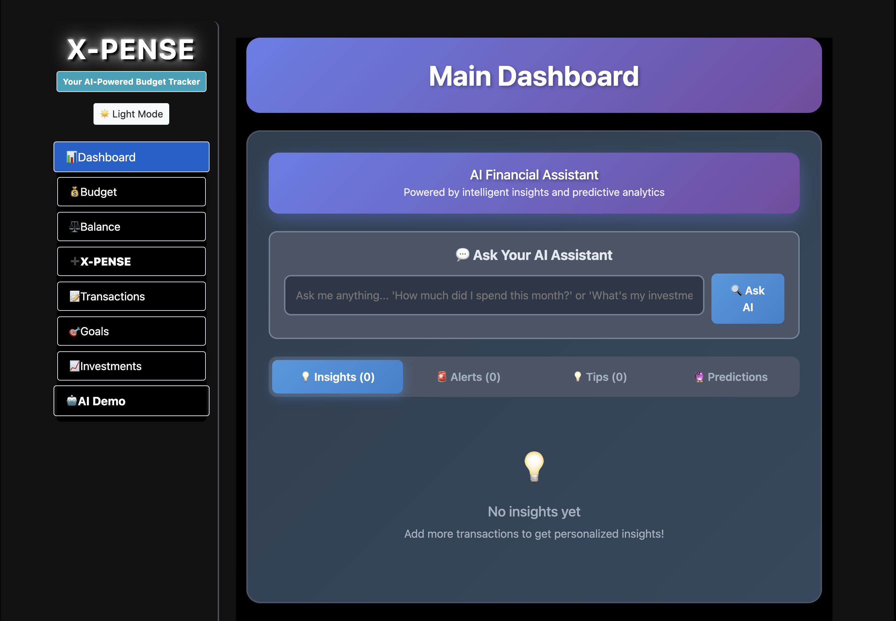

<div style="text-align: center;">
    <h1>X-PENSE</h1>
</div>

<!-- # X-pense App -->


A full-stack expense tracking application built with React and Flask, now powered by advanced AI features.

## 🤖 AI-POWERED FEATURES

### Intelligent Transaction Categorization
- **Automatic AI Categorization**: Transactions are automatically categorized using pattern recognition and machine learning
- **Smart Learning**: The AI learns from your corrections and improves categorization accuracy over time
- **Confidence Scoring**: Each categorization comes with a confidence score to help you trust the AI's decisions
- **Bulk Training**: Train the AI with multiple transactions at once for faster learning

### Advanced Dashboard AI
- **Financial Insights**: Get intelligent analysis of your spending patterns and financial health
- **Predictive Analytics**: AI-powered predictions for future expenses and savings goals
- **Smart Alerts**: Receive intelligent notifications about unusual spending or opportunities to save
- **Natural Language Queries**: Ask questions about your finances in plain English (e.g., "How much did I spend on food last month?")
- **Personalized Recommendations**: Get AI-driven suggestions for budget optimization and financial improvements

### Professional Financial Analysis
- **Financial Health Scoring**: Comprehensive scoring system that evaluates your overall financial wellness
- **Emergency Fund Analysis**: Intelligent assessment of your emergency fund adequacy with months of coverage calculation
- **Liquidity Ratio Analysis**: Professional-grade analysis of your liquid assets vs. total assets
- **Smart Allocation Assistant**: AI-powered recommendations for optimal money distribution across accounts
- **Risk Assessment**: Automated evaluation of financial risks and opportunities

### Enhanced Balance Management
- **Intelligent Account Consolidation**: AI suggests when and how to consolidate low-balance accounts
- **Optimal Allocation Suggestions**: Smart recommendations for distributing money across cash, bank, and savings
- **Financial Health Dashboard**: Real-time metrics and insights about your financial wellness
- **Quick Preset Applications**: AI-curated presets for different financial situations (emergency, student, family)

### Interactive AI Assistant
- **Natural Language Processing**: Chat with your financial data using everyday language
- **Actionable Insights**: AI provides not just information, but actionable recommendations
- **Contextual Help**: Get relevant financial advice based on your current situation
- **Learning Preferences**: AI adapts to your financial goals and preferences over time

## Features is a personal finance management application that allows users to track their cash on hand, bank account balances, savings, expenses and set financial goals. The application is built using Flask for the backend and React for the frontend. In addition, under Investments tab, the user can check a live crypto price update that can be added to the dashboard to calculate over all budget.

## CORE-Features

- Add and manage transactions
- Set and track budget goals
- View balance and budget summaries
- Dark-Light mode support
- Mobile Compatibility
- User authentication
- Live Crypto Update APIs
- Responsive Graphs and Progress Bars
- CRUD ops 
- Input validation checks

### SERVER - Backend Activation
<!-- pipenv install -->
<!-- pipenv shell -->
1. Navigate to the `Server` directory:
```
cd Server
```
1. Run the Flask application: 
```
python app.py
```

### CLIENT - Frontend Activation
1. Navigate to the `Client` directory:
```
cd Client
```
2. Install the required dependencies: 
```
nvm use 20.16
```
3. Start the REact application:
```
npm run dev
```
## Usage

## Usage

- **AI-Enhanced Dashboard**: Consolidates all transactions with intelligent insights and predictions
- **Smart Transaction Entry**: Add transactions with automatic AI categorization and validation
- **Intelligent Balance Management**: Manage cash on hand, bank account balance, savings with AI-powered financial analysis
- **AI-Driven Goal Setting**: Set future goals with intelligent progress tracking and predictive completion dates
- **Smart Investment Tracking**: Monitor crypto investments with live price updates and AI-powered portfolio analysis
- **Natural Language Queries**: Ask questions about your finances in plain English and get intelligent responses
- **Automated Financial Health Monitoring**: Receive real-time financial health scores and professional-grade analysis

## RESTful APIs:
`GET` | `PUT` | `POST` | `DELETE`

## Route Testing With POSTMAN
`GET` Route
```
http://localhost:5001/investments
```

`POST` Route
```
http://localhost:5001/investments
```
```
Example:

{
    "name": "Bitcoin",
    "pricePerUnit": 96063.00,
    "amount": 1,
    "totalPrice": 96063.00
}
```

`PUT` Route
```
Example:

{   
    "amount": 1,
    "totalPrice": 96063.99
}
```


`DELETE` Route <sup>Replace the id# with your id</sup>
```
http://localhost:5001/investments/97
```

## 🧠 AI Features Breakdown

### 1. Intelligent Transaction Categorization Service (`aiCategorization.js`)
- **Pattern Recognition**: Advanced algorithms recognize merchant names and transaction patterns
- **Machine Learning**: Learns from user corrections to improve accuracy over time
- **Confidence Scoring**: Provides confidence levels for each categorization decision
- **Bulk Training**: Process multiple transactions simultaneously for faster AI training
- **Persistent Learning**: Stores learning patterns in localStorage for consistent improvement

### 2. Comprehensive Dashboard AI (`dashboardAI.js`)
- **Financial Insights Generator**: Analyzes spending patterns and provides actionable insights
- **Predictive Analytics Engine**: Forecasts future expenses based on historical data
- **Smart Alert System**: Monitors for unusual spending patterns and optimization opportunities
- **Recommendation Engine**: Provides personalized financial advice and suggestions
- **Natural Language Processing**: Interprets user queries and provides relevant financial information

### 3. Professional Financial Calculator (`financialCalculator.js`)
- **Financial Health Scoring**: Comprehensive scoring algorithm evaluating overall financial wellness
- **Emergency Fund Analysis**: Calculates months of expenses covered by emergency savings
- **Liquidity Ratio Calculation**: Professional-grade analysis of liquid assets vs. total assets
- **Optimal Allocation Engine**: AI-powered recommendations for money distribution
- **Risk Assessment**: Evaluates financial risks and provides mitigation strategies

### 4. Interactive AI Insights Panel (`AIInsightsPanel.jsx`)
- **Tabbed Interface**: Organized presentation of insights, predictions, alerts, and recommendations
- **Natural Language Queries**: Chat interface for asking financial questions in plain English
- **Actionable Navigation**: Direct links to relevant sections based on AI recommendations
- **Real-time Updates**: Dynamic content that adapts to current financial data

### 5. Enhanced Balance Management with AI
- **Smart Validation**: Intelligent input validation with helpful suggestions
- **Account Consolidation**: AI-powered recommendations for optimizing account structure
- **Financial Health Dashboard**: Real-time metrics display with professional calculations
- **Quick Presets**: AI-curated balance presets for different life situations
- **Allocation Assistant**: Smart suggestions for optimal fund distribution

## 🔧 Enhanced Technology Stack

### Frontend Technologies
- **React 18+**: Modern JavaScript library with hooks and context for state management
- **Bootstrap 5**: Responsive CSS framework with custom dark/light mode support
- **HTML5/CSS3**: Modern web standards with advanced styling capabilities
- **JavaScript ES6+**: Modern JavaScript features including async/await, destructuring, and modules

### Backend Technologies
- **Flask 2.x**: Lightweight Python web framework with RESTful API design
- **SQLAlchemy**: Advanced ORM with relationship management and query optimization
- **SQLite/PostgreSQL**: Flexible database options for development and production
- **Flask-Migrate**: Database version control and migration management
- **Flask-CORS**: Cross-origin resource sharing for frontend-backend communication

### AI & Intelligence Technologies
- **Custom AI Engines**: Purpose-built artificial intelligence services for financial analysis
- **Pattern Recognition Algorithms**: Advanced pattern matching for transaction categorization
- **Machine Learning Models**: Adaptive learning systems that improve accuracy over time
- **Natural Language Processing**: Text analysis and understanding for user query interpretation
- **Predictive Analytics**: Statistical models for forecasting financial trends and behaviors
- **Financial Mathematics**: Industry-standard algorithms for professional financial calculations

### Development & DevOps
- **Python 3.8+**: Modern Python runtime with type hints and advanced features
- **Node.js 20.16+**: JavaScript runtime for frontend development and build tools
- **npm/pipenv**: Package management for both frontend and backend dependencies
- **Git**: Distributed version control system for collaborative development
- **VS Code**: Integrated development environment with AI assistance

### Data Management & Persistence
- **localStorage**: Client-side storage for AI learning patterns and user preferences
- **SQLite**: Lightweight database for development and testing
- **PostgreSQL**: Production-ready relational database with advanced features
- **JSON**: Data interchange format for API communication and configuration

## 💡 Enhanced User Experience Features

### AI-Powered Interactions
- **Smart Form Validation**: Intelligent input validation with contextual error messages
- **Predictive Text**: Auto-suggestions based on previous transactions and patterns
- **Contextual Help**: Dynamic assistance that adapts to user's current financial situation
- **Learning Preferences**: AI system that remembers and adapts to user preferences

### Professional Financial Analysis
- **Real-time Metrics**: Live calculation of financial health indicators and ratios
- **Visual Analytics**: Enhanced charts and graphs with AI-generated insights
- **Goal Tracking**: Intelligent progress monitoring with predictive completion dates
- **Risk Assessment**: Automated evaluation of financial risks and opportunities

### Intelligent Automation
- **Auto-categorization**: Seamless transaction classification without user intervention
- **Smart Notifications**: Relevant alerts and recommendations based on spending patterns
- **Optimization Suggestions**: AI-driven recommendations for improving financial health
- **Bulk Operations**: Intelligent batch processing for account management

## Usage

- **AI-Enhanced Dashboard**: Consolidates all transactions with intelligent insights and predictions
- **Smart Transaction Entry**: Add transactions with automatic AI categorization and validation
## Technologies Used

### 🤖 AI & Machine Learning
<div style="text-align: center;">
    <div style='display: inline-block;'>
        
        
        
        
        
        
        
    </div>
</div>

**Enhanced with Custom AI Services:**
- 🧠 **Intelligent Transaction Categorization** - Advanced pattern recognition and machine learning
- 📊 **Financial Health Analysis** - Professional-grade financial calculations and insights  
- 🔮 **Predictive Analytics** - AI-powered forecasting and trend analysis
- 💬 **Natural Language Processing** - Chat with your financial data in plain English
- 🎯 **Smart Recommendations** - Personalized financial advice and optimization suggestions
- 🤖 **Adaptive Learning** - AI that improves and learns from your financial behavior
